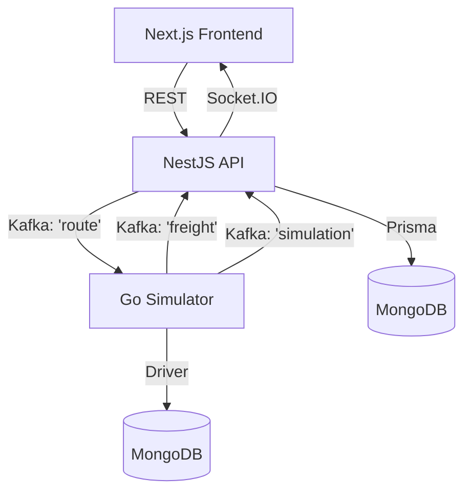

# Rastreio de Veículos e Gestão de Frotas 🚚

Um sistema avançado de rastreamento de frotas em tempo real, focado em alta performance e escalabilidade. O projeto utiliza uma arquitetura baseada em eventos para coordenar a criação de rotas, cálculos de custos e simulações de movimentação.

## 🏗️ Arquitetura do Sistema

A solução é composta por uma malha de microserviços e infraestrutura de mensageria:

### Fluxo de Dados (Event-Driven)
1.  **Criação**: O usuário cria uma rota no Frontend -> API salva no MongoDB -> API publica `RouteCreated` no tópico `route`.
2.  **Cálculo**: O Simulador Go consome `RouteCreated` -> Calcula Frete -> Publica `FreightCalculated` no tópico `freight`.
3.  **Atualização**: A API consome `FreightCalculated` -> Atualiza a rota no banco com o valor final.
4.  **Simulação**: O motorista inicia a viagem -> API publica `DeliveryStarted` no tópico `route`.
5.  **Movimento**: O Simulador GO inicia o envio de coordenadas -> Publica no tópico `simulation`.
6.  **Tempo Real**: A API consome `simulation` -> Reatransmite via WebSockets (Socket.IO) para os clientes conectados.

## 🛠️ Detalhes Técnicos

### Microserviços

#### 1. NestJS API (`nestjs-api`)
Atua como o core business e gateway de eventos.
- **Tecnologias**: NestJS, Prisma ORM, MongoDB, KafkaJS, Socket.IO.
- **Responsabilidades**: CRUD de rotas, integração com Google Maps API, orquestração de WebSockets e consumo de tópicos Kafka.

#### 2. Go Simulator (`golang-simulator`)
Motor de simulação de alto desempenho.
- **Tecnologias**: Go (Golang), Kafka-Go (Segment), MongoDB Driver.
- **Responsabilidades**: Cálculo de frete (baseado em distância), geração de pontos de trajetória e publicação de eventos de movimento.

#### 3. Next.js Frontend (`next-frontend`)
Interface rica e intuitiva.
- **Tecnologias**: Next.js 15, Tailwind CSS, Google Maps SDK, Socket.IO Client.
- **Features**: Visualização de mapas, dashboards para motorista/admin e suporte nativo a Dark Mode premium.

---

### 🛣️ Integração via Kafka (Tópicos)

| Tópico | Evento | Produtor | Consumidor | Descrição |
| :--- | :--- | :--- | :--- | :--- |
| `route` | `RouteCreated` | `nestjs-api` | `golang-simulator` | Notifica nova rota para cálculo de frete. |
| `route` | `DeliveryStarted` | `nestjs-api` | `golang-simulator` | Comando para iniciar a simulação de movimento. |
| `freight` | `FreightCalculated` | `golang-simulator` | `nestjs-api` | Valor do frete calculado pelo simulador. |
| `simulation` | `DriverMoved` | `golang-simulator` | `nestjs-api` | Novas coordenadas do veículo (emissão Socket.IO). |

---

### 🔌 API Endpoints (REST)

#### Rotas
- `GET /routes`: Recupera todas as rotas salvas.
- `GET /routes/:id`: Detalhes de uma rota específica (incluindo geometria do mapa).
- `POST /routes`: Cria uma nova rota (dispara evento Kafka).
- `POST /routes/:id/start`: Inicia a simulação da rota escolhida.

---

### 📡 WebSockets (Socket.IO)

- **Namespace: `/`**
- **Evento `server:new-points/${route_id}:list`**: Recebido pelo Motorista para atualizar sua posição no mapa.
- **Evento `server:new-points:list`**: Recebido pelo Administrador para ver todos os veículos do sistema.

## 📦 Como rodar

1.  **Infra**: `docker-compose up -d` (Kafka e Mongo).
2.  **API**: `nestjs-api` -> `npm install` && `npm run dev`.
3.  **Simulador**: `golang-simulator` -> `go run cmd/simulator/main.go`.
4.  **Frontend**: `next-frontend` -> `npm install` && `npm run dev`.

---
Desenvolvido para demonstrar uma arquitetura moderna e escalável de rastreamento logístico.
